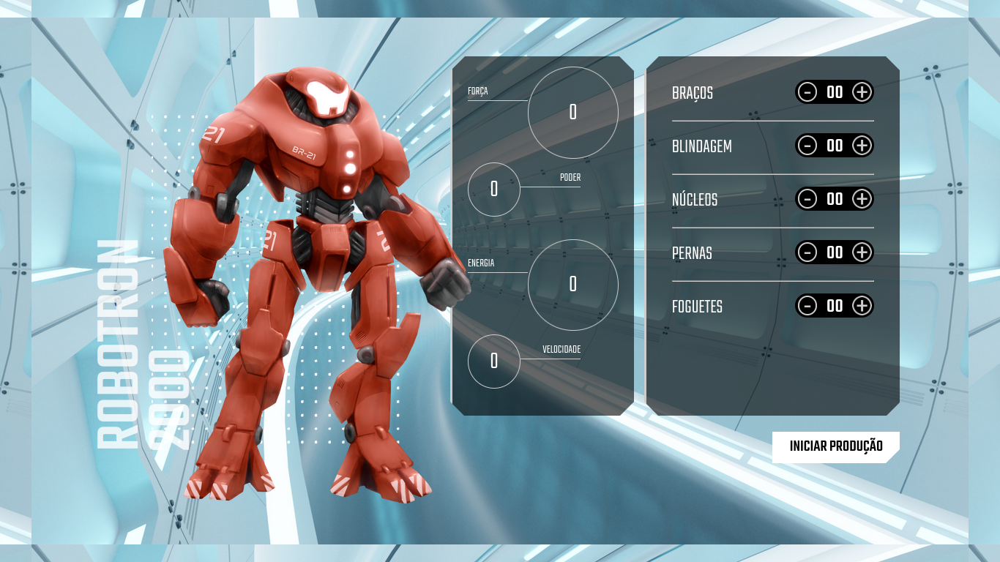

# robotron-2000

Esse projeto consiste em montar um robô para ajudar as forças de defesa do planeta terra, pois ela está sendo invadida por alienígenas, e para isso é necessário que você adicione peças na engrenagem que compoẽ um robô e as estatísticas são alterada dinamicamente, e tudo isso será feito com o javascript.

Não fique fora dessa, acesse agora a <a href="https://robotron-2000-swart-gamma.vercel.app/">demo</a> 🚀 e venha montar o seu robô.

## Tecnologias utilizadas 🛠️
*  HTML5
*  CSS3 
*  JAVASCRIPT 

## Funcionalidades do projeto
1. [x] Adicionar braços ao robô
2. [x] Adicionar blindagem ao robô
3. [x] Adicionar núcleos ao robô
4. [x] Adicionar pernas ao robô
5. [x] Adicionar foguetes ao robô
6. [x] Refletir poderes do robô de acordo com a estatística
7. [x] Trocar a cor do robô ao clicar no botão
8. [ ] Construção do layout mobile

## Status do projeto

🚧 Em construção 🚧

